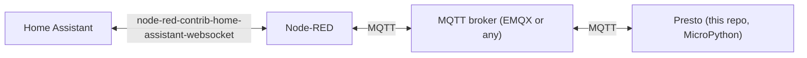

# Presto Home Assistant Dashboard

A MicroPython tiled dashboard for the [Pimoroni Presto](https://shop.pimoroni.com/products/presto)
(an RP2350-based touchscreen), talking to [Home Assistant](https://www.home-assistant.io/) entirely
over MQTT via a Node-RED bridge. Visually modeled on
[compresto](https://git.hack-hro.de/kmohrf/compresto), built as an app on top of
[TmOS](https://github.com/themissingcow/pimoroni-presto-tmos).

- **Touch tiles** for toggles (lights/switches, with a brightness modal for dimmables), read-only
  sensors with threshold-colored backgrounds, one-shot scenes/scripts, and a clock/date tile.
- **MQTT-only** integration — the firmware never talks to HA's REST/WebSocket API directly, has no
  HA long-lived access token, and doesn't know HA entity IDs. A Node-RED flow bridges specific HA
  entities to a small, fixed MQTT topic contract; the firmware only ever speaks that contract.
- **Declarative layout** — what's on screen and where is a plain Python list in `config.py`, not
  hardcoded per-device markup.

## How it fits together



Node-RED (running inside/alongside HA) subscribes to specific HA entity state changes, translates
them into small JSON payloads on `presto/<domain>/<slug>/state` (retained), and relays commands the
other way from `presto/<domain>/<slug>/set` into HA service calls. The firmware only knows about
these topic strings — see `dashboard/topics.py` for the full contract:

| Domain | `/state` payload | `/set` payload | Notes |
|---|---|---|---|
| `light` | `{"state": "on"/"off", "brightness"?: 0-255}` | same shape | brightness optional both ways |
| `switch` | `{"state": "on"/"off"}` | same shape | no brightness field |
| `sensor` | `{"value": <number>, ...}` | — | read-only |
| `scene` / `script` | — | `{}` | write-only trigger, no state |

Plus `presto/device/<device_id>/status` (this device's own LWT: `online`/`offline`) and
`presto/bridge/status` (the Node-RED bridge's LWT), both retained.

## Repository layout

- `main.py`, `config.py` — boot entry point and the declarative tile/entity registry.
- `dashboard/` — this project's app code: grid/palette/theme, `DashboardState` (pub/sub), tile
  primitives, MQTT client wrapper, and the top-level TmOS `App`.
- `tmos.py`, `tmos_ui.py`, `tmos_apps.py`, `tmos_themes.py` — vendored TmOS (MIT-licensed, unmodified
  — see `VENDORING.md`).
- `umqtt/simple.py` — vendored `umqtt.simple` (MIT-licensed).
- `node-red/presto-bridge.flow.json` — importable Node-RED flow implementing the HA <-> MQTT bridge
  described above. Ships with placeholder entity IDs and broker hostname — see setup below.
- `scripts/` — on-device sanity checks that don't touch flash/`main.py` (see "Trying it without
  flashing" below).
- `tests/` — host-side pytest suite for the pure-logic parts of `dashboard/`.

## Requirements

- A Pimoroni Presto, connected over USB.
- An MQTT broker reachable from both the Presto and your Home Assistant instance (e.g. the EMQX or
  Mosquitto add-on for HA OS/Supervised, or any standalone broker on your LAN).
- Home Assistant with [Node-RED](https://github.com/hassio-addons/addon-node-red) and the
  [`node-red-contrib-home-assistant-websocket`](https://github.com/zachowj/node-red-contrib-home-assistant-websocket)
  palette installed (flow was built against `0.80.3`).
- [`uv`](https://docs.astral.sh/uv/) for host-side tooling (`mpremote`, `pytest`).

## Setup

### 1. Host tooling

```
uv sync
```

This installs `mpremote` (device deployment) and `pytest` (host-side tests) into a local venv.
`mpremote` is the only supported way to talk to the device:

```
uv run mpremote connect list      # find the device's serial port
```

If multiple serial devices are connected, target the Presto explicitly with
`uv run mpremote connect <PORT> ...` for every command below.

### 2. Wi-Fi / MQTT credentials

```
cp secrets.example.py secrets.py
```

Fill in `WIFI_SSID` / `WIFI_PASSWORD` (read directly by the Presto firmware's own `presto.connect()`
— don't rename these) and `MQTT_HOST` / `MQTT_PORT` / `MQTT_USER` / `MQTT_PASSWORD` for your broker.
`secrets.py` is gitignored — never commit real credentials.

### 3. Declare your tiles

Edit `config.py`: `DEVICE_ID` (used for this device's own MQTT status topic) and the `TILES` list.
Each entry addresses `dashboard.grid`'s 16-column grid (`col`/`row`/`colspan`/`rowspan` —
`STANDARD_SPAN` is a "normal" 1-tile size) and picks a `type` of `toggle`, `sensor`, `scene`, or
`datetime`. See the existing entries for the shape each type expects (e.g. `sensor` tiles take a
`thresholds` list of `(upper_bound, *_SCALE)` pairs resolved against `dashboard/palette.py`).

### 4. Wire up the Node-RED bridge

Import `node-red/presto-bridge.flow.json` into Node-RED (menu → Import). It ships with three
placeholder entity IDs (`switch.example_switch`, `light.example_dimmer`, `sensor.example_temperature`)
and a placeholder MQTT broker hostname (`YOUR_EMQX_BROKER_HOSTNAME`) — edit these to point at your
real HA entities and broker, and set the topic strings in each `mqtt out`/`mqtt in` node to match the
slugs you used in `config.py`. The flow's own `info` tab documents the quirks this bridge design works
around (event payload shape, JSONata data fields for `api-call-service`, etc.).

### 5. Deploy to the device

Copy the vendored framework, this project's code, and your config/secrets onto the device (this does
**not** persist as `main.py` yet, so it won't auto-boot):

```
uv run mpremote cp tmos.py tmos_ui.py tmos_apps.py tmos_themes.py :
uv run mpremote cp -r umqtt :
uv run mpremote cp -r dashboard :
uv run mpremote cp config.py secrets.py :
```

Then copy `main.py` itself and reset:

```
uv run mpremote cp main.py :
uv run mpremote reset
```

The device will connect to Wi-Fi, sync its clock via NTP, connect to your MQTT broker, and start
rendering the dashboard.

## Trying it without flashing

- `uv run mpremote run scripts/preview_main.py` — runs the grid/theme/tile layer standalone against a
  fake in-memory MQTT stand-in, with no real broker and without touching `main.py` on flash. Good for
  checking layout/touch behavior changes.
- `uv run mpremote run scripts/device_smoke_test.py` — minimal proof that TmOS boots and this
  project's `dashboard` package imports cleanly under real MicroPython (not just the CPython test
  stubs).
- `uv run mpremote run scripts/mqtt_smoke_test.py` — isolates "does the device receive retained MQTT
  messages" from the rest of the app, using your real `secrets.py`.

## Testing

```
uv run pytest
```

Runs the host-side suite under desktop CPython, using stubs for `presto`/`picographics`/`picovector`/
`touch`/`ntptime` (see `tests/conftest.py`). This covers the pure-logic modules
(`dashboard/grid.py`, `palette.py`, `state_store.py`, `topics.py`, `tz.py`, etc.) but **not** real
socket I/O or PicoGraphics rendering — those need the on-device scripts above. Always run via
`uv run pytest`, not a bare `pytest`.

## License

AGPL-3.0-or-later — see `LICENSE`. `tmos*.py` and `umqtt/simple.py` are vendored from separately
MIT-licensed upstreams and keep their original terms (see `VENDORING.md`). Several `dashboard/`
modules port or adapt design from compresto (AGPL-3.0) — see `CLAUDE.md`'s "Licensing" section for
which files and why.
