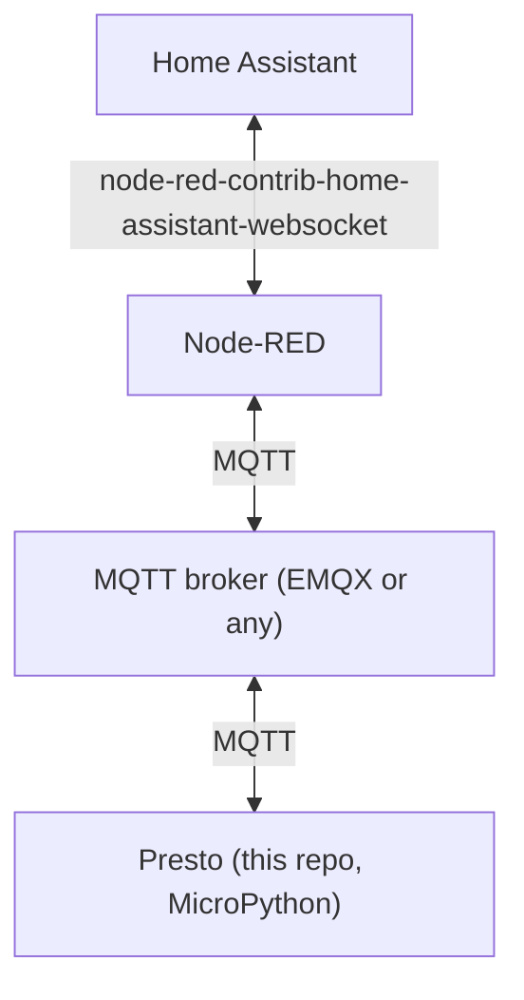

# Presto Home Assistant Dashboard

A MicroPython tiled dashboard for the [Pimoroni Presto](https://shop.pimoroni.com/products/presto)
(an RP2350-based touchscreen), talking to [Home Assistant](https://www.home-assistant.io/) entirely
over MQTT via a Node-RED bridge. Visually modeled on
[compresto](https://git.hack-hro.de/kmohrf/compresto), built as an app on top of
[TmOS](https://github.com/themissingcow/pimoroni-presto-tmos).

- **Touch tiles** for toggles (lights/switches, with a brightness modal for dimmables), read-only
  sensors with threshold-colored backgrounds, one-shot scenes/scripts, and a clock/date tile.
- **MQTT-only** integration — the firmware never talks to HA's REST/WebSocket API directly, has no
  HA long-lived access token, and doesn't know HA entity IDs. A Node-RED flow bridges specific HA
  entities to a small, fixed MQTT topic contract; the firmware only ever speaks that contract.
- **Declarative, remote layout** — what's on screen and where is JSON, published retained over MQTT
  to a per-device config topic (Node-RED owns it), not hardcoded per-device markup. A device can show
  more than one screen, switchable via the systray's page tabs.

## How it fits together



Node-RED (running inside/alongside HA) subscribes to specific HA entity state changes, translates
them into small JSON payloads on `presto/<domain>/<slug>/state` (retained), and relays commands the
other way from `presto/<domain>/<slug>/set` into HA service calls. The firmware only knows about
these topic strings — see `dashboard/topics.py` for the full contract:

| Domain | `/state` payload | `/set` payload | Notes |
|---|---|---|---|
| `light` | `{"state": "on"/"off", "brightness"?: 0-255}` | same shape | brightness optional both ways |
| `switch` | `{"state": "on"/"off"}` | same shape | no brightness field |
| `sensor` | `{"value": <number>, ...}` | — | read-only |
| `weather` | `{"condition": <string>, "temperature"?: <number>, "humidity"?: <number>}` | — | read-only; `condition` is one of Home Assistant's 15 `weather.*` states (`sunny`, `cloudy`, `rainy`, etc.); `humidity` (a plain 0-100 percentage) is only shown in the wider tile sizes (8x4/16x6), not the 4x4 size |
| `scene` / `script` | — | `{}` | write-only trigger, no state |

Plus `presto/device/<device_id>/status` (this device's own LWT: `online`/`offline`) and
`presto/bridge/status` (the Node-RED bridge's LWT), both retained.

## Repository layout

- `main.py`, `config.py` — boot entry point, plus this device's `DEVICE_ID` and a minimal fallback
  screen shown until its real config arrives over MQTT (see "Declare your tiles" below).
- `dashboard/` — this project's app code: grid/palette/theme, `DashboardState` (pub/sub), tile
  primitives, MQTT client wrapper, and the top-level TmOS `App`.
- `tmos.py`, `tmos_ui.py`, `tmos_apps.py`, `tmos_themes.py` — vendored TmOS (MIT-licensed, unmodified
  — see `VENDORING.md`).
- `umqtt/simple.py` — vendored `umqtt.simple` (MIT-licensed).
- `node-red/presto-bridge.flow.json` — importable Node-RED flow implementing the HA <-> MQTT bridge
  described above. Ships with placeholder entity IDs and broker hostname — see setup below.
- `scripts/` — on-device sanity checks that don't touch flash/`main.py` (see "Trying it without
  flashing" below).
- `tests/` — host-side pytest suite for the pure-logic parts of `dashboard/`.

## Requirements

- A Pimoroni Presto, connected over USB.
- An MQTT broker reachable from both the Presto and your Home Assistant instance (e.g. the EMQX or
  Mosquitto add-on for HA OS/Supervised, or any standalone broker on your LAN).
- Home Assistant with [Node-RED](https://github.com/hassio-addons/addon-node-red) and the
  [`node-red-contrib-home-assistant-websocket`](https://github.com/zachowj/node-red-contrib-home-assistant-websocket)
  palette installed (flow was built against `0.80.3`).
- [`uv`](https://docs.astral.sh/uv/) for host-side tooling (`mpremote`, `pytest`).

## Setup

### 1. Host tooling

```
uv sync
```

This installs `mpremote` (device deployment) and `pytest` (host-side tests) into a local venv.
`mpremote` is the only supported way to talk to the device:

```
uv run mpremote connect list      # find the device's serial port
```

If multiple serial devices are connected, target the Presto explicitly with
`uv run mpremote connect <PORT> ...` for every command below.

### 2. Wi-Fi / MQTT credentials

```
cp secrets.example.py secrets.py
```

Fill in `WIFI_SSID` / `WIFI_PASSWORD` (read directly by the Presto firmware's own `presto.connect()`
— don't rename these) and `MQTT_HOST` / `MQTT_PORT` / `MQTT_USER` / `MQTT_PASSWORD` for your broker.
`secrets.py` is gitignored — never commit real credentials.

### 3. Declare your tiles

Edit `config.py`'s `DEVICE_ID` — used both as this device's MQTT client ID and to build its own
status/config topics (`presto/device/<DEVICE_ID>/status`, `presto/device/<DEVICE_ID>/config`).
`config.py`'s `DEFAULT_SCREENS` is only a fallback (a single minimal screen) shown until the
device's real config arrives over MQTT — see below for how that's published; you generally don't
need to edit `DEFAULT_SCREENS` beyond picking something reasonable to show before the broker/Node-RED
flow is up.

The real, per-device screens/tiles are published as a **retained** JSON message to
`presto/device/<DEVICE_ID>/config` (QoS 0), shaped as:

```json
{
  "screens": [
    {
      "title": "Dashboard",
      "tiles": [
        {
          "type": "toggle", "domain": "switch", "slug": "lamp", "label": "LAMP",
          "col": 0, "row": 0, "colspan": 4, "rowspan": 4
        },
        {
          "type": "toggle", "domain": "light", "slug": "ceiling", "label": "CEILING", "dimmable": true,
          "col": 4, "row": 0, "colspan": 4, "rowspan": 4
        },
        {
          "type": "sensor", "domain": "sensor", "slug": "office_temp", "label": "OFFICE", "unit": "C",
          "col": 8, "row": 0, "colspan": 4, "rowspan": 4,
          "thresholds": [[18, "SKY_SCALE"], [25, "GREEN_SCALE"], [28, "AMBER_SCALE"], [null, "ROSE_SCALE"]]
        },
        {
          "type": "scene", "domain": "scene", "slug": "good_night", "label": "GOOD NIGHT",
          "col": 12, "row": 0, "colspan": 4, "rowspan": 4
        },
        {
          "type": "datetime",
          "col": 0, "row": 4, "colspan": 8, "rowspan": 4
        },
        {
          "type": "weather", "domain": "weather", "slug": "home", "label": "OUTSIDE", "unit": "F",
          "col": 0, "row": 10, "colspan": 16, "rowspan": 6
        }
      ]
    }
  ]
}
```

Each screen becomes its own `Page`, switchable via tabs in the systray — add more entries to
`"screens"` for more than one. Each tile entry addresses `dashboard.grid`'s 16-column grid
(`col`/`row`/`colspan`/`rowspan` — 4 is a "normal" 1-tile size, i.e. `dashboard.grid.STANDARD_SPAN`)
and picks a `type` of `toggle`, `sensor`, `scene`, `datetime`, or `weather`; `sensor` tiles'
`thresholds` are `[upper_bound, *_SCALE]` pairs resolved against `dashboard/palette.py`. `weather`
tiles show temperature + label always, plus an MDI weather icon
(`dashboard/weather_icons.py`) — except at a 4-column-wide (`colspan: 4`) size, which drops the icon
and matches a `sensor` tile's layout instead, since there isn't room for both; wider sizes (e.g.
`colspan: 8` or `16`) put a half-size icon beside the temperature. `unit` is an optional display-only
suffix (e.g. `"F"` or `"C"`) appended after the degree symbol — it's purely cosmetic, the `/state`
payload's `temperature` field is unitless as far as the
firmware is concerned, so send whatever unit you want displayed and label it accordingly. Republishing
a new retained message at any time (no reboot needed) swaps the device's screens live.

### 4. Wire up the Node-RED bridge

Import `node-red/presto-bridge.flow.json` into Node-RED (menu → Import). It ships with three
placeholder entity IDs (`switch.example_switch`, `light.example_dimmer`, `sensor.example_temperature`)
and a placeholder MQTT broker hostname (`YOUR_EMQX_BROKER_HOSTNAME`) — edit these to point at your
real HA entities and broker, and set the topic strings in each `mqtt out`/`mqtt in` node to match the
slugs used in the screens/tiles config you publish (see "Declare your tiles" above). The flow's own
`info` tab documents the quirks this bridge design works around (event payload shape, JSONata data
fields for `api-call-service`, etc.).

For a `weather` tile, add your own `weather.*` entity node (not included in the shipped flow) and a
JSONata `change`/`function` node that flattens its state + attributes into
`{"condition": msg.payload.state, "temperature": msg.payload.data.attributes.temperature, "humidity": msg.payload.data.attributes.humidity}`
before the `mqtt out` node — `condition` is HA's own `weather.*` state string (`sunny`, `cloudy`,
`rainy`, ...), `temperature`/`humidity` are attributes, not the state. `humidity` is optional — omit
it (or send `null`) if your weather entity doesn't report one.

#### Publishing this device's config

The flow above bridges entity *state*, but doesn't publish the `screens`/`tiles` config itself —
add that as two extra nodes:

1. **Add an `inject` node.** Set its `msg.topic` field to
   `presto/device/<DEVICE_ID>/config` (the exact value of your `config.py`'s `DEVICE_ID`, e.g.
   `presto/device/presto-office/config`). Set its payload type to **JSON**, and paste in your
   `{"screens": [...]}` config (see "Declare your tiles" above for the shape). Node-RED's inject
   editor validates the JSON for you before it'll let you save.
2. **Wire its output into an `mqtt out` node**, pointed at the same broker as the rest of the flow.
   Leave the `mqtt out` node's own Topic field blank so it uses `msg.topic` from the inject node
   (or set it explicitly to the same string). **Set QoS to 0 and, critically, Retain to `true`** —
   the firmware only ever receives this config by subscribing and picking up whatever's retained on
   the topic (see `dashboard/mqtt_client.py`'s `_connect()`); a non-retained publish only reaches
   the device if it happens to already be online and subscribed at that exact moment.
3. Deploy, then click the inject node's button to publish. To confirm it actually reached the
   device (and parses the way the firmware expects), run
   `uv run mpremote run scripts/config_topic_smoke_test.py` — see "Trying it without flashing"
   below.
4. Whenever you want to change a device's layout, edit the inject node's JSON payload and click it
   again — republishing a new retained message swaps that device's screens live, no reboot needed.
   Repeat this pair of nodes (with a different topic/payload) for each additional device.

### 5. Deploy to the device

Copy the vendored framework, this project's code, and your config/secrets onto the device (this does
**not** persist as `main.py` yet, so it won't auto-boot):

```
uv run mpremote cp tmos.py tmos_ui.py tmos_apps.py tmos_themes.py :
uv run mpremote cp -r umqtt :
uv run mpremote cp -r dashboard :
uv run mpremote cp config.py secrets.py :
```

Then copy `main.py` itself and reset:

```
uv run mpremote cp main.py :
uv run mpremote reset
```

The device will connect to Wi-Fi, sync its clock via NTP, connect to your MQTT broker, and start
rendering the dashboard.

## Trying it without flashing

- `uv run mpremote run scripts/preview_main.py` — runs the grid/theme/tile layer standalone against a
  fake in-memory MQTT stand-in, with no real broker and without touching `main.py` on flash. Good for
  checking layout/touch behavior changes.
- `uv run mpremote run scripts/device_smoke_test.py` — minimal proof that TmOS boots and this
  project's `dashboard` package imports cleanly under real MicroPython (not just the CPython test
  stubs).
- `uv run mpremote run scripts/mqtt_smoke_test.py` — isolates "does the device receive retained MQTT
  messages" from the rest of the app, using your real `secrets.py`.
- `uv run mpremote run scripts/config_topic_smoke_test.py` — connects wifi + your real broker,
  subscribes to this device's `presto/device/<DEVICE_ID>/config` topic, and prints whatever arrives
  run through the real `dashboard.topics.parse_config_payload` — confirms Node-RED's actual published
  screens/tiles config round-trips correctly before trusting it to swap the live dashboard.

## Testing

```
uv run pytest
```

Runs the host-side suite under desktop CPython, using stubs for `presto`/`picographics`/`picovector`/
`touch`/`ntptime` (see `tests/conftest.py`). This covers the pure-logic modules
(`dashboard/grid.py`, `palette.py`, `state_store.py`, `topics.py`, `tz.py`, etc.) but **not** real
socket I/O or PicoGraphics rendering — those need the on-device scripts above. Always run via
`uv run pytest`, not a bare `pytest`.

## License

AGPL-3.0-or-later — see `LICENSE`. `tmos*.py` and `umqtt/simple.py` are vendored from separately
MIT-licensed upstreams and keep their original terms (see `VENDORING.md`). Several `dashboard/`
modules port or adapt design from compresto (AGPL-3.0) — see `CLAUDE.md`'s "Licensing" section for
which files and why.
